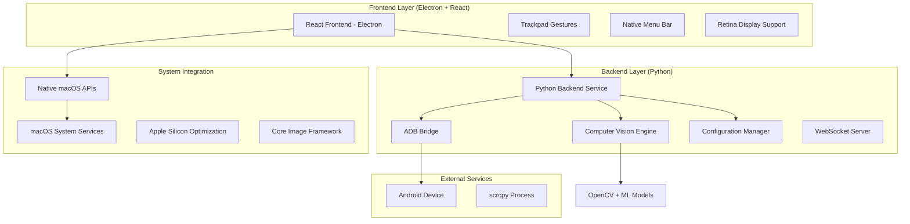
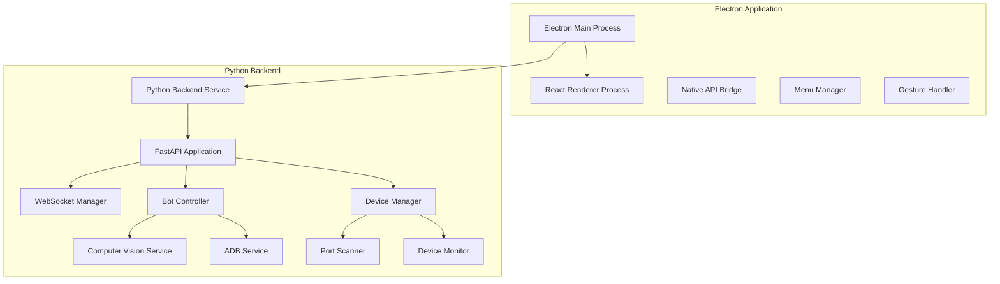
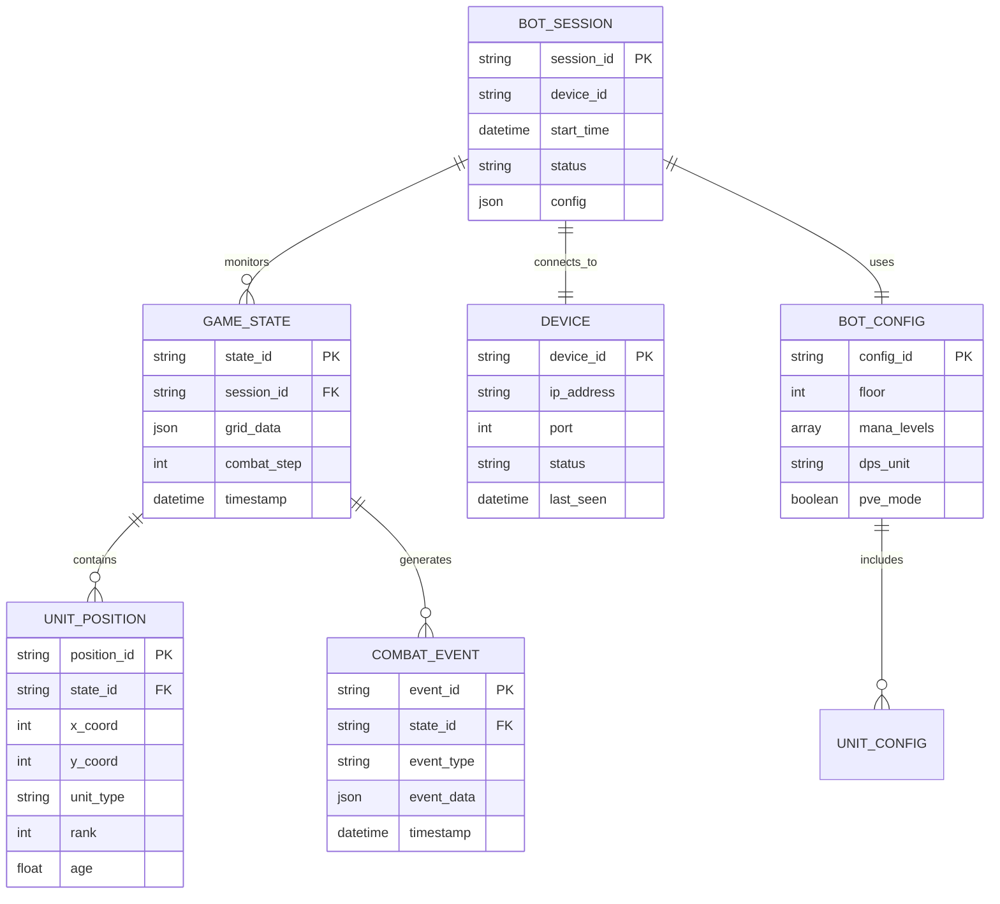

# Technical Architecture Document: Rush Royale Bot macOS Adaptation

## 1. Architecture Design



## 2. Technology Description

* **Frontend**: React\@18 + Electron\@28 + TypeScript\@5 + Tailwind CSS\@3

* **Backend**: Python\@3.13 + FastAPI\@0.104 + WebSockets

* **Computer Vision**: OpenCV\@4.12 + NumPy\@2.1 + scikit-learn\@1.7

* **Device Control**: pure-python-adb\@0.3 + scrcpy (native binary)

* **macOS Integration**: Electron Native APIs + Objective-C bridges

* **Build System**: Vite\@5 + electron-builder\@24

## 3. Route Definitions

| Route       | Purpose                                     |
| ----------- | ------------------------------------------- |
| /           | Главная страница с панелью управления ботом |
| /settings   | Страница настроек конфигурации и юнитов     |
| /monitoring | Страница мониторинга игрового процесса      |
| /devices    | Управление Android устройствами и ADB       |
| /system     | Системные настройки и интеграция с macOS    |
| /logs       | Детальные логи и отладочная информация      |

## 4. API Definitions

### 4.1 Core API

**Bot Control API**

```
POST /api/bot/start
```

Request:

| Param Name | Param Type | isRequired | Description                   |
| ---------- | ---------- | ---------- | ----------------------------- |
| device\_id | string     | true       | ID Android устройства         |
| config     | BotConfig  | true       | Конфигурация бота             |
| pve\_mode  | boolean    | false      | Режим PvE (по умолчанию true) |

Response:

| Param Name | Param Type | Description               |
| ---------- | ---------- | ------------------------- |
| status     | boolean    | Статус запуска            |
| bot\_id    | string     | Уникальный ID сессии бота |
| message    | string     | Сообщение о результате    |

Example:

```json
{
  "device_id": "192.168.1.100:5555",
  "config": {
    "floor": 5,
    "mana_levels": [1, 2, 3, 4, 5],
    "units": ["demo", "monk", "robot"],
    "dps_unit": "monk"
  },
  "pve_mode": true
}
```

**Device Management API**

```
GET /api/devices/scan
```

Response:

| Param Name | Param Type | Description                    |
| ---------- | ---------- | ------------------------------ |
| devices    | Device\[]  | Список доступных устройств     |
| count      | number     | Количество найденных устройств |

**WebSocket Events**

```
ws://localhost:8000/ws/bot/{bot_id}
```

Events:

* `bot_status`: Статус бота в реальном времени

* `game_state`: Состояние игрового поля

* `combat_info`: Информация о текущем бое

* `error`: Ошибки и предупреждения

### 4.2 macOS Native API Integration

**Trackpad Gestures**

```typescript
interface TrackpadGestures {
  onPinch: (scale: number) => void;
  onSwipe: (direction: 'left' | 'right' | 'up' | 'down') => void;
  onForceTouch: (pressure: number) => void;
}
```

**Native Menu Integration**

```typescript
interface NativeMenu {
  createApplicationMenu(): void;
  updateMenuState(state: MenuState): void;
  registerShortcuts(shortcuts: Shortcut[]): void;
}
```

## 5. Server Architecture Diagram



## 6. Data Model

### 6.1 Data Model Definition



### 6.2 Data Definition Language

**Configuration Storage (JSON)**

```json
{
  "bot_config": {
    "floor": 5,
    "mana_levels": [1, 2, 3, 4, 5],
    "units": ["demo", "monk", "robot", "dryad", "franky_stein"],
    "dps_unit": "monk",
    "pve_mode": true,
    "require_shaman": false
  },
  "macos_settings": {
    "retina_scaling": 2.0,
    "trackpad_gestures": true,
    "native_menu": true,
    "dock_integration": true,
    "auto_start": false
  },
  "performance_settings": {
    "apple_silicon_optimization": true,
    "metal_acceleration": true,
    "core_image_processing": true,
    "background_processing": false
  }
}
```

**Device Registry (SQLite)**

```sql
-- Создание таблицы устройств
CREATE TABLE devices (
    device_id TEXT PRIMARY KEY,
    ip_address TEXT NOT NULL,
    port INTEGER DEFAULT 5555,
    device_name TEXT,
    android_version TEXT,
    status TEXT DEFAULT 'disconnected',
    last_connected TIMESTAMP,
    created_at TIMESTAMP DEFAULT CURRENT_TIMESTAMP
);

-- Создание таблицы сессий бота
CREATE TABLE bot_sessions (
    session_id TEXT PRIMARY KEY,
    device_id TEXT REFERENCES devices(device_id),
    config_json TEXT,
    start_time TIMESTAMP DEFAULT CURRENT_TIMESTAMP,
    end_time TIMESTAMP,
    status TEXT DEFAULT 'running',
    total_battles INTEGER DEFAULT 0,
    successful_battles INTEGER DEFAULT 0
);

-- Создание индексов
CREATE INDEX idx_devices_status ON devices(status);
CREATE INDEX idx_sessions_device ON bot_sessions(device_id);
CREATE INDEX idx_sessions_status ON bot_sessions(status);

-- Инициализация данных
INSERT INTO devices (device_id, ip_address, device_name) 
VALUES ('emulator-5554', '127.0.0.1', 'Android Emulator');
```

**Apple Silicon Optimization Settings**

```typescript
interface AppleSiliconConfig {
  metalAcceleration: boolean;
  coreImageProcessing: boolean;
  neuralEngineUsage: boolean;
  memoryOptimization: {
    unifiedMemory: boolean;
    compressionLevel: number;
  };
  thermalManagement: {
    enableThrottling: boolean;
    maxTemperature: number;
  };
}
```

