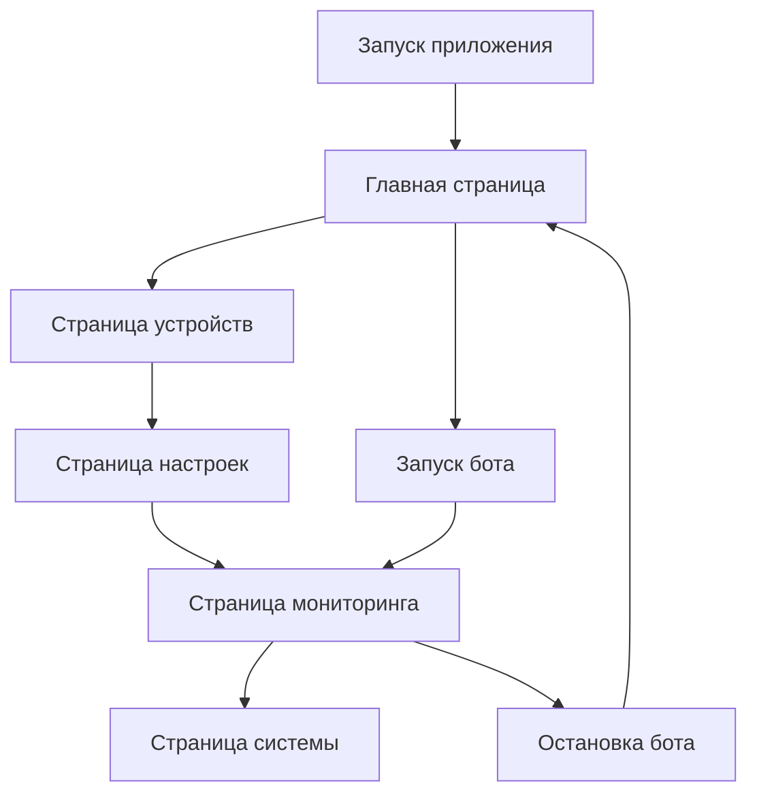

# Product Requirements Document: Rush Royale Bot macOS Adaptation

## 1. Product Overview

Полная адаптация Rush Royale Bot под операционную систему macOS с переходом от tkinter на современный React-интерфейс. Проект включает глубокую интеграцию с нативными сервисами macOS, оптимизацию под Apple Silicon (M1/M2) и поддержку всех стандартов платформы.

Основная цель - создание современного кроссплатформенного приложения с нативным пользовательским опытом macOS, включая поддержку жестов трекпада, нативных меню и оптимизацию под Retina-дисплеи.

## 2. Core Features

### 2.1 User Roles

| Роль         | Метод регистрации       | Основные права                                        |
| ------------ | ----------------------- | ----------------------------------------------------- |
| Пользователь | Локальная установка     | Полный доступ к функциям бота, настройка конфигурации |
| Разработчик  | Доступ к исходному коду | Модификация кода, отладка, расширение функционала     |

### 2.2 Feature Module

Наше приложение Rush Royale Bot для macOS состоит из следующих основных страниц:

1. **Главная страница**: панель управления ботом, статус подключения, быстрые действия
2. **Страница настроек**: конфигурация бота, выбор юнитов, настройки уровней маны
3. **Страница мониторинга**: отображение игрового поля, статистика боя, логи в реальном времени
4. **Страница устройств**: управление ADB подключениями, настройка scrcpy
5. **Страница системы**: интеграция с macOS, настройки производительности

### 2.3 Page Details

| Название страницы    | Название модуля              | Описание функции                                                                        |
| -------------------- | ---------------------------- | --------------------------------------------------------------------------------------- |
| Главная страница     | Панель управления            | Запуск/остановка бота, отображение текущего статуса, быстрый доступ к основным функциям |
| Главная страница     | Статус подключения           | Индикатор подключения к Android устройству, статус ADB соединения                       |
| Главная страница     | Быстрые действия             | Кнопки экстренного выхода из игры, перезапуска бота                                     |
| Страница настроек    | Конфигурация бота            | Настройка этажа подземелья, режима PvE/PvP, целевых уровней маны                        |
| Страница настроек    | Выбор юнитов                 | Интерактивный выбор игровых юнитов с превью, настройка DPS юнита                        |
| Страница настроек    | Настройки производительности | Оптимизация под Apple Silicon, настройки Retina дисплея                                 |
| Страница мониторинга | Игровое поле                 | Визуализация текущего состояния игрового поля в реальном времени                        |
| Страница мониторинга | Статистика боя               | Отображение статистики: средний возраст юнитов, количество демонов, прогресс боя        |
| Страница мониторинга | Логи системы                 | Консоль логов с фильтрацией по уровням, экспорт логов                                   |
| Страница устройств   | ADB управление               | Сканирование и подключение Android устройств, управление соединениями                   |
| Страница устройств   | Scrcpy интеграция            | Настройка зеркалирования экрана, управление качеством трансляции                        |
| Страница системы     | macOS интеграция             | Настройки нативного меню, жестов трекпада, уведомлений                                  |
| Страница системы     | Системные настройки          | Управление автозапуском, интеграция с Dock, горячие клавиши                             |

## 3. Core Process

**Основной пользовательский процесс:**

1. Пользователь запускает приложение через Dock или Launchpad
2. Система автоматически сканирует доступные Android устройства
3. Пользователь выбирает устройство и настраивает параметры бота
4. Запускается процесс автоматизации с отображением статуса в реальном времени
5. Пользователь может управлять ботом через нативное меню или жесты трекпада
6. Система предоставляет детальную аналитику и логи процесса

## 4. User Interface Design

### 4.1 Design Style

* **Основные цвета**:

  * Основной: #007AFF (системный синий macOS)

  * Вторичный: #34C759 (системный зеленый)

  * Фон: #F2F2F7 (светлая тема), #000000 (темная тема)

  * Акцент: #FF3B30 (системный красный для предупреждений)

* **Стиль кнопок**: Скругленные углы (8px), поддержка системных состояний (hover, active, disabled)

* **Шрифты**:

  * Основной: SF Pro Display (системный шрифт macOS)

  * Моноширинный: SF Mono (для логов и кода)

  * Размеры: 11pt (caption), 13pt (body), 17pt (headline), 28pt (title)

* **Стиль макета**:

  * Sidebar navigation с поддержкой collapse

  * Card-based компоненты с тенями

  * Нативная прокрутка с momentum scrolling

* **Иконки**: SF Symbols для максимальной интеграции с macOS

### 4.2 Page Design Overview

| Название страницы    | Название модуля     | UI Элементы                                                                                   |
| -------------------- | ------------------- | --------------------------------------------------------------------------------------------- |
| Главная страница     | Панель управления   | Большие кнопки действий с SF Symbols, статусные индикаторы с анимацией, прогресс-бары         |
| Страница настроек    | Конфигурация        | Нативные формы с валидацией, toggle switches, sliders для числовых значений                   |
| Страница мониторинга | Визуализация        | Canvas для отображения игрового поля, таблицы с сортировкой, консоль с syntax highlighting    |
| Страница устройств   | Управление          | Список устройств с refresh control, connection status badges, QR-код для быстрого подключения |
| Страница системы     | Системные настройки | Нативные системные элементы, интеграция с System Preferences                                  |

### 4.3 Responsiveness

Приложение разработано desktop-first с адаптацией под различные размеры экранов Mac:

* Минимальное разрешение: 1280x800 (MacBook Air 13")

* Оптимизация для Retina дисплеев с поддержкой @2x и @3x ресурсов

* Поддержка жестов трекпада: pinch-to-zoom, swipe navigation, force touch для контекстных меню

* Адаптивная sidebar с автоматическим collapse на малых экранах

